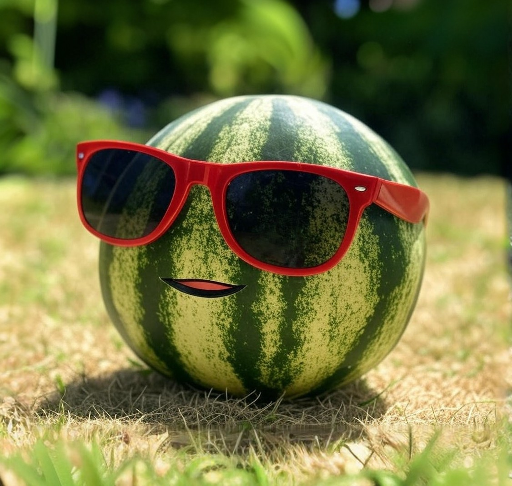

# 🤖 Учусь ИИ и мучаю пиксели

 Это `img1.png`. Она многое видела. И пережила. Особенно `for` внутри `for` внутри `sigmoid`...

---

## 📚 Что это?

Это **не первая нейросеть**.
Это **целый сборник**, где я обучался ИИ: от "как не сломать NumPy" до "зачем я вообще полез в OpenCV".

Здесь код, видеоуроки, эксперименты, немного боли, много Python и душа, вложенная между `def` и `return`.

---

## 📦 Что внутри?

### 🧪 Learn1 — первые нейро-эксперименты

🔗 [GitHub: Learn1](https://github.com/ReNothingg/Learn1)
📺 [YouTube: *"Твоя ПЕРВАЯ НЕЙРОСЕТЬ на Python с нуля! | За 10 минут :3"*](https://www.youtube.com/watch?v=tihq_bLfk08) Наивный код. Великие амбиции. Почти получилось.

---

### 👁️ OpenCV1 — взгляд нейросети на этот мир

🔗 [GitHub: OpenCV1](https://github.com/ReNothingg/OpenCV1)
📺 [YouTube плейлист: *"Уроки Python OpenCV"*](https://www.youtube.com/playlist?list=PL0lO_mIqDDFUAQ2RdAgLp6Tj_fREcxk6T) Когда камера включается, но нейросеть всё равно не узнаёт твоё лицо...

---

### И что нибудь когда нибудь...
---

## 🛠️ Что я узнал?

* `np.dot()` — это твой друг. Пока не станет врагом.
* OpenCV любит камеры. Но не твою.
* `sigmoid` — звучит как диагноз, но работает.
* Иногда ошибка — это тоже обучение. Особенно если она `ValueError: shapes not aligned`.

---

## 🧠 Зачем это смотреть?

* Хочешь понять, как **не надо** писать нейросети?
* Учишься ИИ?
* Тебе просто нравится смотреть, как кто-то страдает с Python?

Добро пожаловать в клуб. 🍵